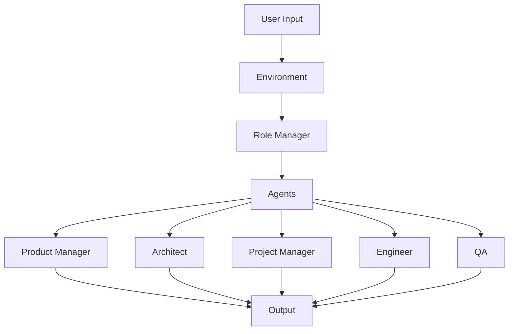

# Architecture Overview

MetaGPT's architecture is designed to simulate a software company's workflow through multi-agent collaboration.

## System Architecture

## Core Components

### Environment
- Manages shared context and resources
- Handles agent communication
- Maintains project state

### Role Manager
- Assigns roles to agents
- Coordinates workflows
- Manages task transitions

### Agents
Each agent has:
- Specific role and responsibilities
- Knowledge base and capabilities
- Communication protocols
- Action patterns

## Communication Flow

1. User input processed by Environment
2. Role Manager assigns tasks
3. Agents collaborate through messages
4. Results consolidated and validated
5. Final output generated