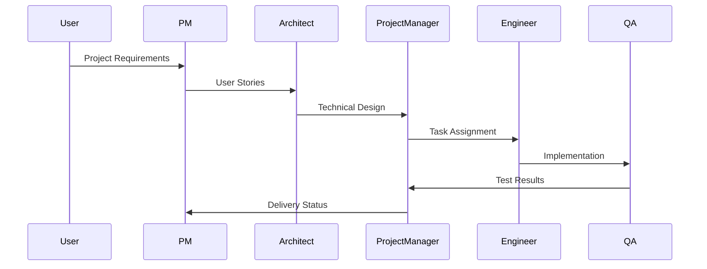

# Multi-Agent System

MetaGPT's multi-agent system simulates a software development team where each agent has specialized roles and responsibilities.

## Agent Types

### Product Manager (PM)
- Analyzes requirements
- Creates user stories
- Defines acceptance criteria
- Prioritizes features

### Architect
- Designs system architecture
- Makes technology choices
- Ensures scalability
- Maintains technical standards

### Project Manager
- Creates task breakdown
- Manages dependencies
- Tracks progress
- Coordinates team efforts

### Engineer
- Implements features
- Writes clean code
- Follows best practices
- Performs code reviews

### Quality Assurance (QA)
- Writes test cases
- Performs testing
- Ensures code quality
- Reports issues

## Agent Interaction

### Communication Protocol


## Customization

### Creating Custom Roles
```python
from metagpt.roles import Role

class CustomRole(Role):
    def __init__(self):
        super().__init__()
        self.name = "CustomRole"
        self.profile = "Specialized role profile"

    async def run(self, context):
        # Role-specific logic
        pass
```

### Role Configuration
- Define custom behaviors
- Add specialized knowledge
- Modify interaction patterns
- Extend capabilities