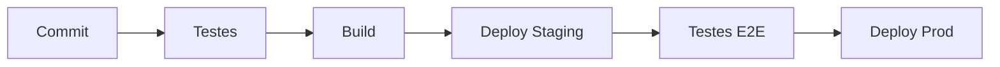

# Quality Assurance (QA)

## Estratégia de Testes

### Testes Unitários
- Backend: Jest
- Frontend: React Testing Library
- Cobertura mínima: 80%

### Testes de Integração
- API: Supertest
- E2E: Cypress
- Fluxos críticos:
  - Cadastro/Login
  - Lançamentos
  - Pagamentos

### Testes de Performance
- K6 para testes de carga
- New Relic para monitoramento
- Métricas principais:
  - Tempo de resposta
  - Throughput
  - Erro rate

## Ambientes

### Desenvolvimento
- Local: Docker compose
- Dev: AWS desenvolvimento
- Staging: Réplica de produção

### CI/CD Pipeline

## Monitoramento

### Métricas
- Uptime
- Latência
- Erros
- Uso de recursos

### Alertas
- Disponibilidade
- Performance
- Erros críticos
- Uso de recursos

### Logging
- Centralizado (ELK Stack)
- Retention: 30 dias
- Níveis: INFO, WARN, ERROR